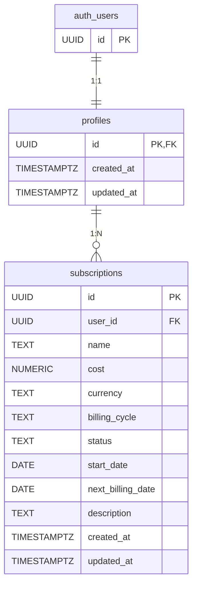

# Database Schema — Subbase (MVP)

## 1. Tables

### 1.1 profiles

Stores user profile data linked to Supabase Auth. Created automatically via trigger when a new user registers.

| Column | Type | Constraints | Description |
|--------|------|-------------|-------------|
| `id` | `UUID` | `PRIMARY KEY`, `REFERENCES auth.users(id) ON DELETE CASCADE` | User ID copied from auth.users |
| `created_at` | `TIMESTAMPTZ` | `NOT NULL`, `DEFAULT now()` | Profile creation timestamp |
| `updated_at` | `TIMESTAMPTZ` | `NOT NULL`, `DEFAULT now()` | Last update timestamp |

### 1.2 subscriptions

Stores all subscription data for users.

| Column | Type | Constraints | Description |
|--------|------|-------------|-------------|
| `id` | `UUID` | `PRIMARY KEY`, `DEFAULT gen_random_uuid()` | Unique subscription identifier |
| `user_id` | `UUID` | `NOT NULL`, `REFERENCES profiles(id) ON DELETE CASCADE` | Owner of the subscription |
| `name` | `TEXT` | `NOT NULL` | Subscription name (e.g., "Netflix", "Spotify") |
| `cost` | `NUMERIC(10,2)` | `NOT NULL`, `CHECK (cost > 0 AND cost <= 100000)` | Subscription cost per billing cycle |
| `currency` | `TEXT` | `NOT NULL`, `DEFAULT 'PLN'` | Currency code (prepared for future multi-currency support) |
| `billing_cycle` | `TEXT` | `NOT NULL`, `CHECK (billing_cycle IN ('monthly', 'yearly'))` | Billing frequency |
| `status` | `TEXT` | `NOT NULL`, `DEFAULT 'active'`, `CHECK (status IN ('active', 'paused', 'cancelled'))` | Current subscription status |
| `start_date` | `DATE` | `NOT NULL` | Date when subscription started |
| `next_billing_date` | `DATE` | `CHECK (next_billing_date >= start_date)` | Next payment date (nullable for cancelled subscriptions) |
| `description` | `TEXT` | | Optional notes about the subscription |
| `created_at` | `TIMESTAMPTZ` | `NOT NULL`, `DEFAULT now()` | Record creation timestamp |
| `updated_at` | `TIMESTAMPTZ` | `NOT NULL`, `DEFAULT now()` | Last update timestamp |

---

## 2. Relationships

### 2.1 Entity Relationship Diagram (Mermaid)



### 2.2 Relationship Details

| Relationship | Type | Description |
|--------------|------|-------------|
| `auth.users` → `profiles` | One-to-One | Each authenticated user has exactly one profile. Profile ID equals auth.users ID. |
| `profiles` → `subscriptions` | One-to-Many | One user can have many subscriptions. Each subscription belongs to exactly one user. |

### 2.3 Cascade Behavior

- Deleting a user from `auth.users` cascades to `profiles`
- Deleting a profile cascades to all related `subscriptions`

---

## 3. Indexes

| Table | Index Name | Column(s) | Type | Purpose |
|-------|------------|-----------|------|---------|
| `profiles` | `profiles_pkey` | `id` | PRIMARY KEY (automatic) | Primary key lookup |
| `subscriptions` | `subscriptions_pkey` | `id` | PRIMARY KEY (automatic) | Primary key lookup |
| `subscriptions` | `subscriptions_user_id_idx` | `user_id` | B-TREE | Critical for RLS policy performance and user subscription queries |

**Note:** Index on `status` column is intentionally omitted due to low cardinality (only 3 values). PostgreSQL query planner typically prefers sequential scan for such columns on small datasets.

---

## 4. PostgreSQL Row-Level Security (RLS) Policies

### 4.1 Enable RLS

```sql
ALTER TABLE profiles ENABLE ROW LEVEL SECURITY;
ALTER TABLE subscriptions ENABLE ROW LEVEL SECURITY;
```

### 4.2 Policies for `profiles` Table

| Policy Name | Operation | Definition | Description |
|-------------|-----------|------------|-------------|
| `profiles_select_own` | SELECT | `auth.uid() = id` | Users can only read their own profile |

**Note:** INSERT, UPDATE, DELETE policies are not defined for profiles. Profile creation is handled by a SECURITY DEFINER trigger, and users cannot modify or delete their profiles directly.

### 4.3 Policies for `subscriptions` Table

| Policy Name | Operation | USING Clause | WITH CHECK Clause | Description |
|-------------|-----------|--------------|-------------------|-------------|
| `subscriptions_select_own` | SELECT | `auth.uid() = user_id` | — | Users can only view their own subscriptions |
| `subscriptions_insert_own` | INSERT | — | `auth.uid() = user_id` | Users can only create subscriptions for themselves |
| `subscriptions_update_own` | UPDATE | `auth.uid() = user_id` | `auth.uid() = user_id` | Users can only update their own subscriptions |
| `subscriptions_delete_own` | DELETE | `auth.uid() = user_id` | — | Users can only delete their own subscriptions |

---

## 5. Functions and Triggers

### 5.1 Automatic `updated_at` Timestamp

Reusable function for all tables requiring automatic timestamp updates.

```sql
CREATE OR REPLACE FUNCTION update_updated_at_column()
RETURNS TRIGGER AS $$
BEGIN
    NEW.updated_at = now();
    RETURN NEW;
END;
$$ LANGUAGE plpgsql;
```

#### Triggers

| Table | Trigger Name | Event | Timing |
|-------|--------------|-------|--------|
| `profiles` | `profiles_updated_at` | UPDATE | BEFORE |
| `subscriptions` | `subscriptions_updated_at` | UPDATE | BEFORE |

### 5.2 Automatic Profile Creation on User Registration

```sql
CREATE OR REPLACE FUNCTION handle_new_user()
RETURNS TRIGGER
SECURITY DEFINER
SET search_path = public
AS $$
BEGIN
    INSERT INTO public.profiles (id, created_at, updated_at)
    VALUES (NEW.id, now(), now());
    RETURN NEW;
END;
$$ LANGUAGE plpgsql;

CREATE TRIGGER on_auth_user_created
    AFTER INSERT ON auth.users
    FOR EACH ROW
    EXECUTE FUNCTION handle_new_user();
```

**Note:** `SECURITY DEFINER` attribute is required because the trigger executes during user registration when RLS policies would otherwise block the INSERT.

### 5.3 Automatic Profile Deletion on User Deletion

Profile deletion is handled automatically by the `ON DELETE CASCADE` foreign key constraint from `profiles.id` to `auth.users.id`.

---

## 6. Complete SQL Migration

```sql
-- =============================================
-- SUBBASE DATABASE SCHEMA
-- =============================================

-- 1. TABLES
-- ---------------------------------------------

-- profiles table
CREATE TABLE profiles (
    id UUID PRIMARY KEY REFERENCES auth.users(id) ON DELETE CASCADE,
    created_at TIMESTAMPTZ NOT NULL DEFAULT now(),
    updated_at TIMESTAMPTZ NOT NULL DEFAULT now()
);

-- subscriptions table
CREATE TABLE subscriptions (
    id UUID PRIMARY KEY DEFAULT gen_random_uuid(),
    user_id UUID NOT NULL REFERENCES profiles(id) ON DELETE CASCADE,
    name TEXT NOT NULL,
    cost NUMERIC(10,2) NOT NULL CHECK (cost > 0 AND cost <= 100000),
    currency TEXT NOT NULL DEFAULT 'PLN',
    billing_cycle TEXT NOT NULL CHECK (billing_cycle IN ('monthly', 'yearly')),
    status TEXT NOT NULL DEFAULT 'active' CHECK (status IN ('active', 'paused', 'cancelled')),
    start_date DATE NOT NULL,
    next_billing_date DATE CHECK (next_billing_date >= start_date),
    description TEXT,
    created_at TIMESTAMPTZ NOT NULL DEFAULT now(),
    updated_at TIMESTAMPTZ NOT NULL DEFAULT now()
);

-- 2. INDEXES
-- ---------------------------------------------

CREATE INDEX subscriptions_user_id_idx ON subscriptions(user_id);

-- 3. FUNCTIONS
-- ---------------------------------------------

-- Reusable function for updating updated_at timestamp
CREATE OR REPLACE FUNCTION update_updated_at_column()
RETURNS TRIGGER AS $$
BEGIN
    NEW.updated_at = now();
    RETURN NEW;
END;
$$ LANGUAGE plpgsql;

-- Function to create profile on user registration
CREATE OR REPLACE FUNCTION handle_new_user()
RETURNS TRIGGER
SECURITY DEFINER
SET search_path = public
AS $$
BEGIN
    INSERT INTO public.profiles (id, created_at, updated_at)
    VALUES (NEW.id, now(), now());
    RETURN NEW;
END;
$$ LANGUAGE plpgsql;

-- 4. TRIGGERS
-- ---------------------------------------------

-- Auto-update updated_at for profiles
CREATE TRIGGER profiles_updated_at
    BEFORE UPDATE ON profiles
    FOR EACH ROW
    EXECUTE FUNCTION update_updated_at_column();

-- Auto-update updated_at for subscriptions
CREATE TRIGGER subscriptions_updated_at
    BEFORE UPDATE ON subscriptions
    FOR EACH ROW
    EXECUTE FUNCTION update_updated_at_column();

-- Auto-create profile on user registration
CREATE TRIGGER on_auth_user_created
    AFTER INSERT ON auth.users
    FOR EACH ROW
    EXECUTE FUNCTION handle_new_user();

-- 5. ROW-LEVEL SECURITY
-- ---------------------------------------------

-- Enable RLS
ALTER TABLE profiles ENABLE ROW LEVEL SECURITY;
ALTER TABLE subscriptions ENABLE ROW LEVEL SECURITY;

-- Policies for profiles
CREATE POLICY profiles_select_own ON profiles
    FOR SELECT
    USING (auth.uid() = id);

-- Policies for subscriptions
CREATE POLICY subscriptions_select_own ON subscriptions
    FOR SELECT
    USING (auth.uid() = user_id);

CREATE POLICY subscriptions_insert_own ON subscriptions
    FOR INSERT
    WITH CHECK (auth.uid() = user_id);

CREATE POLICY subscriptions_update_own ON subscriptions
    FOR UPDATE
    USING (auth.uid() = user_id)
    WITH CHECK (auth.uid() = user_id);

CREATE POLICY subscriptions_delete_own ON subscriptions
    FOR DELETE
    USING (auth.uid() = user_id);
```

---

## 7. Seed Data

Example test data for development (to be placed in `supabase/seed.sql`):

```sql
-- Note: This seed data requires an existing user in auth.users
-- Run after creating a test user through Supabase Auth

-- Example subscriptions for testing (replace USER_ID with actual UUID)
-- INSERT INTO subscriptions (user_id, name, cost, billing_cycle, status, start_date, next_billing_date, description)
-- VALUES
--     ('USER_ID', 'Netflix', 43.00, 'monthly', 'active', '2024-01-15', '2025-02-15', 'Standard plan'),
--     ('USER_ID', 'Spotify', 19.99, 'monthly', 'active', '2023-06-01', '2025-02-01', 'Premium individual'),
--     ('USER_ID', 'Adobe Creative Cloud', 239.88, 'yearly', 'active', '2024-03-10', '2025-03-10', 'Photography plan'),
--     ('USER_ID', 'Microsoft 365', 299.00, 'yearly', 'active', '2024-05-20', '2025-05-20', 'Family subscription'),
--     ('USER_ID', 'YouTube Premium', 25.99, 'monthly', 'paused', '2024-02-01', '2025-01-01', 'Paused for now'),
--     ('USER_ID', 'Gym Membership', 89.00, 'monthly', 'cancelled', '2023-01-01', NULL, 'Cancelled in December'),
--     ('USER_ID', 'Disney+', 37.99, 'monthly', 'active', '2024-08-15', '2025-02-15', NULL),
--     ('USER_ID', 'HBO Max', 29.99, 'monthly', 'active', '2024-10-01', '2025-02-01', 'With ads');
```

---

## 8. Design Notes

### 8.1 Decisions and Rationale

1. **Separate `profiles` table**: Standard Supabase pattern to bridge `auth.users` with application data. Enables cleaner RLS policies and future extensibility.

2. **CHECK constraints over ENUM**: Using CHECK constraints for `billing_cycle` and `status` instead of PostgreSQL ENUM types. Adding new values to ENUM requires migration, while CHECK constraints can be modified more easily.

3. **NUMERIC(10,2) for cost**: Prevents floating-point precision issues with financial data. Maximum value of 99,999,999.99 is more than sufficient for subscription tracking.

4. **Hard delete**: Soft delete (deleted_at column) was explicitly rejected for MVP simplicity. Can be added later if audit requirements emerge.

5. **Ephemeral AI insights**: AI-generated insights are not stored in the database. They are computed on-demand from current subscription data.

6. **Server-side user_id assignment**: While RLS WITH CHECK prevents users from creating subscriptions for other users, the application layer should always set `user_id = auth.uid()` rather than accepting it from client input.

7. **Timestamps in UTC**: All TIMESTAMPTZ columns store UTC values. Frontend is responsible for timezone conversion for display.

8. **Cost calculations in application**: Monthly and yearly totals are calculated in the application layer, not in the database. This simplifies MVP architecture and testing.

### 8.2 Future Considerations (Out of MVP Scope)

- Multi-currency support (currency column prepared)
- Categories/tags for subscriptions
- AI insights history table
- Notification scheduling based on next_billing_date
- Soft delete with deleted_at column
- Composite index on (user_id, billing_cycle) if filtering by cycle becomes common
