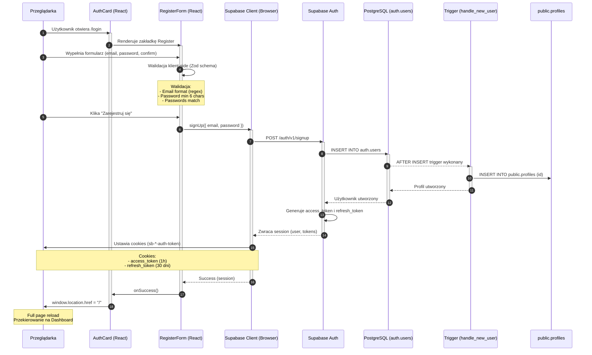
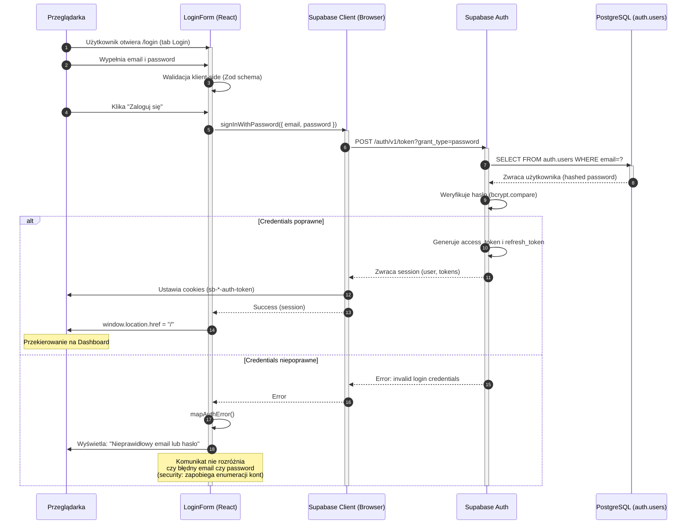
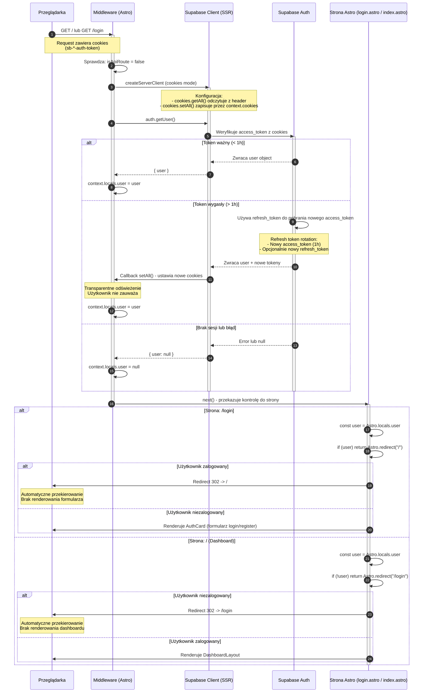
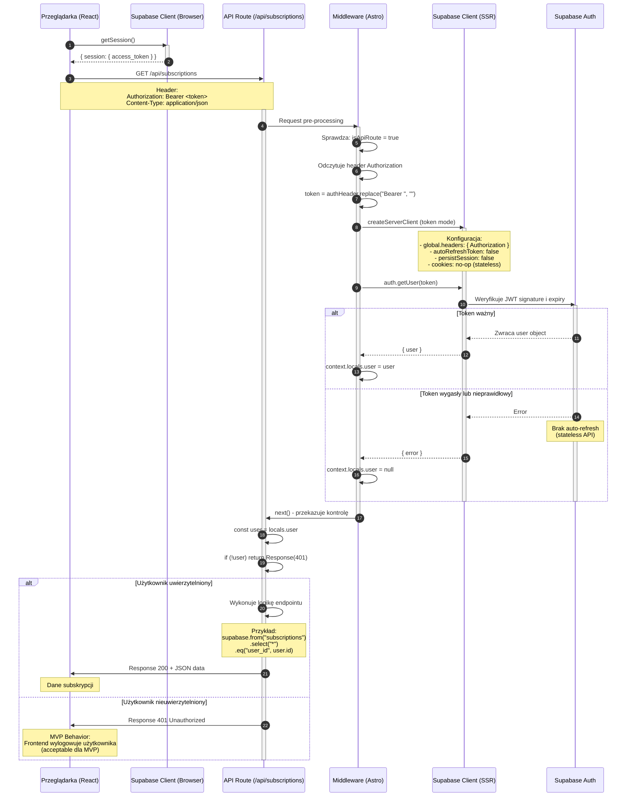
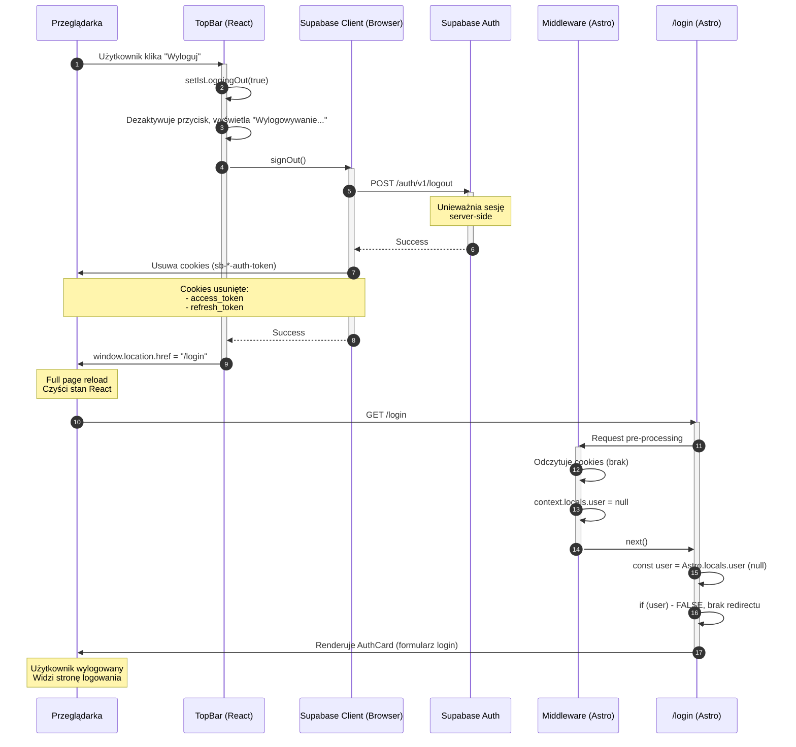
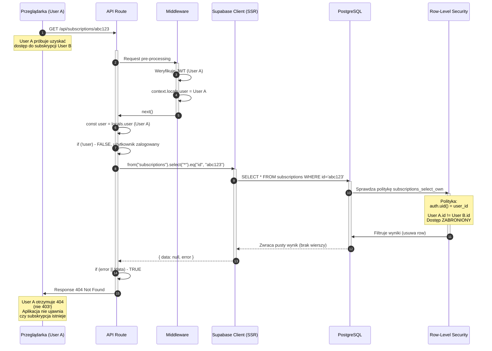
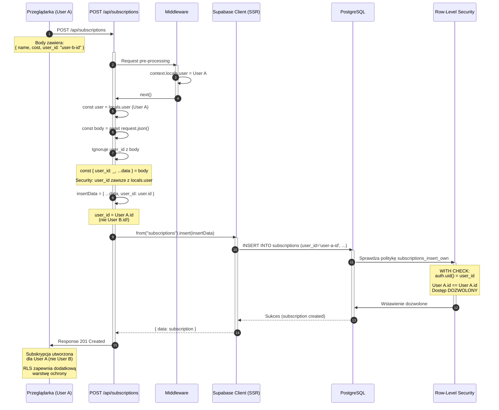

# Diagram Architektury Autentykacji - Subbase

## Przepływ 1: Rejestracja Użytkownika

<mermaid_diagram>

</mermaid_diagram>

---

## Przepływ 2: Logowanie Użytkownika

<mermaid_diagram>

</mermaid_diagram>

---

## Przepływ 3: Weryfikacja Sesji (SSR - Strony Astro)

<mermaid_diagram>

</mermaid_diagram>

---

## Przepływ 4: Weryfikacja JWT (API Routes)

<mermaid_diagram>

</mermaid_diagram>

---

## Przepływ 5: Wylogowanie Użytkownika

<mermaid_diagram>

</mermaid_diagram>

---

## Przepływ 6: Ochrona RLS (Row-Level Security)

<mermaid_diagram>

</mermaid_diagram>

---

## Przepływ 7: Próba Utworzenia Subskrypcji dla Innego Użytkownika

<mermaid_diagram>

</mermaid_diagram>

---

## Legenda Aktorów

| Aktor | Opis |
|-------|------|
| **Przeglądarka** | Środowisko użytkownika - przechowuje cookies, wykonuje requesty HTTP |
| **React Components** | Komponenty UI (LoginForm, RegisterForm, TopBar) - interakcja użytkownika |
| **Supabase Client (Browser)** | Klient Supabase dla przeglądarki (`@supabase/ssr` - `createBrowserClient`) |
| **Middleware (Astro)** | Warstwa pośrednia weryfikująca sesję przed każdym requestem |
| **Supabase Client (SSR)** | Klient Supabase dla serwera (`@supabase/ssr` - `createServerClient`) |
| **Strona Astro** | Renderowanie SSR z guard clauses (redirects) |
| **API Route** | Endpoint REST API (np. `/api/subscriptions`) |
| **Supabase Auth** | Usługa autentykacji Supabase - zarządzanie użytkownikami, tokeny JWT |
| **PostgreSQL** | Baza danych - `auth.users`, `public.profiles`, `public.subscriptions` |
| **RLS (Row-Level Security)** | Polityki PostgreSQL filtrujące wiersze na podstawie `auth.uid()` |
| **Trigger** | Funkcja SQL wykonywana automatycznie (np. `handle_new_user`) |

---

## Kluczowe Mechanizmy Bezpieczeństwa

### 1. Dwutorowa Autentykacja

**Strony Astro (Cookie-Based):**
- Cookies przechowują access_token i refresh_token
- Middleware automatycznie odświeża tokeny (refresh token rotation)
- Brak przerwy w sesji dla użytkownika
- SSR guard clauses - redirects przed renderowaniem UI

**API Routes (Token-Based):**
- JWT przekazywany w header `Authorization: Bearer <token>`
- Stateless - brak automatycznego odświeżania tokenów
- `autoRefreshToken: false`, `persistSession: false`
- MVP: użytkownik wylogowywany przy wygasłym tokenie (acceptable behavior)

### 2. Row-Level Security (RLS)

**Izolacja danych użytkowników:**
- Polityki RLS filtrują wyniki zapytań na poziomie bazy danych
- `auth.uid() = user_id` - tylko własne dane
- Dwuwarstwowa ochrona: server-side enforcement + RLS
- Błąd 404 (nie 403) - nie ujawnia istnienia zasobów

**Polityki:**
- `subscriptions_select_own` - odczyt tylko własnych subskrypcji
- `subscriptions_insert_own` - tworzenie tylko dla siebie
- `subscriptions_update_own` - aktualizacja tylko własnych
- `subscriptions_delete_own` - usuwanie tylko własnych

### 3. Automatyczne Odświeżanie Tokenów (SSR)

**Proces transparentny:**
1. Middleware wywołuje `getUser()` przy każdym request
2. Supabase wykrywa wygasły access_token (> 1h)
3. Automatycznie używa refresh_token do pobrania nowego
4. Callback `setAll()` ustawia nowe cookies
5. Użytkownik nie zauważa procesu

**Refresh Token Rotation:**
- Access token: 1 godzina (krótkoterminowy)
- Refresh token: 30 dni (długoterminowy)
- Opcjonalnie: nowy refresh token przy odświeżaniu (increased security)

### 4. Zapobieganie Enumeracji Kont

**Komunikaty błędów:**
- Login error: "Nieprawidłowy email lub hasło" (nie rozróżnia który błędny)
- 404 zamiast 403 - nie ujawnia istnienia zasobów
- Generyczne komunikaty - brak szczegółów technicznych

---

## Konfiguracja Wymagana dla MVP

### Supabase Dashboard Settings

**Authentication → Settings:**
```
✅ Enable email confirmations: OFF (WYMAGANE dla MVP)
   - US-001 wymaga automatycznego logowania po rejestracji
   - Email confirmation blokowałaby ten przepływ

✅ Enable signup: ON

✅ Site URL: https://<domain>

✅ Redirect URLs:
   - https://<domain>/
   - http://localhost:4321/ (development)
```

### Zmienne Środowiskowe

**Server-side:**
```bash
SUPABASE_URL=https://<project-ref>.supabase.co
SUPABASE_KEY=<anon-key>
```

**Client-side:**
```bash
PUBLIC_SUPABASE_URL=https://<project-ref>.supabase.co
PUBLIC_SUPABASE_KEY=<anon-key>
```

---

## Przyszłe Rozszerzenia (POZA ZAKRESEM MVP)

### HTTP Interceptor dla Refresh Tokenów (API Routes)

**Obecne zachowanie (MVP):**
- API route zwraca 401 Unauthorized przy wygasłym tokenie
- Frontend wylogowuje użytkownika (acceptable dla MVP)

**Przyszłe rozszerzenie:**
```typescript
// Przykładowa implementacja interceptora
fetch(url, { headers })
  .then(response => {
    if (response.status === 401) {
      // Automatyczne odświeżenie tokenu
      return refreshToken().then(newToken => {
        // Ponów request z nowym tokenem
        return fetch(url, { 
          headers: { ...headers, Authorization: `Bearer ${newToken}` }
        });
      });
    }
    return response;
  });
```

**Zalety:**
- Brak przerwy w sesji użytkownika
- Transparentne odświeżanie tokenów dla API calls
- Lepsze UX (użytkownik nie musi ponownie się logować)

---

**Data utworzenia:** 2026-01-29  
**Status:** Zgodne z PRD (US-001, US-002, US-003)  
**Architektura:** Astro 5 SSR + React 19 + Supabase Auth + PostgreSQL RLS
