# Diagram Podróży Użytkownika — Subbase

## Wprowadzenie

Ten dokument przedstawia diagram podróży użytkownika (User Journey) dla aplikacji Subbase, obejmujący pełny cykl życia użytkownika: od pierwszej wizyty, przez rejestrację/logowanie, zarządzanie subskrypcjami, aż po wylogowanie.

Diagram został utworzony na podstawie:
- Product Requirements Document (PRD)
- Specyfikacji Technicznej Autentykacji (auth-spec.md)
- Rzeczywistej implementacji w kodzie

## Diagram Podróży Użytkownika

```mermaid
stateDiagram-v2
    [*] --> WizytaNaStronie
    
    state "Wizyta na Stronie" as WizytaNaStronie {
        [*] --> SprawdzenieAutentykacji
        SprawdzenieAutentykacji --> CzyZalogowany
        
        state CzyZalogowany <<choice>>
        CzyZalogowany --> StronaLogowania: Niezalogowany
        CzyZalogowany --> Dashboard: Zalogowany
    }
    
    state "Strona Logowania" as StronaLogowania {
        [*] --> WyborZakladki
        
        state "Wybór Zakładki" as WyborZakladki {
            [*] --> ZakladkaLogin
            ZakladkaLogin --> ZakladkaRegister: Przełącz zakładkę
            ZakladkaRegister --> ZakladkaLogin: Przełącz zakładkę
        }
        
        WyborZakladki --> FormularzLogowania: Zakładka Login
        WyborZakladki --> FormularzRejestracji: Zakładka Register
        
        state "Formularz Logowania" as FormularzLogowania {
            [*] --> WprowadzenieEmailHaslo
            WprowadzenieEmailHaslo --> WalidacjaFormularzaLogin
            
            state WalidacjaFormularzaLogin <<choice>>
            WalidacjaFormularzaLogin --> BledyWalidacjiLogin: Błędne dane
            WalidacjaFormularzaLogin --> WywolanieSupabaseLogin: Dane poprawne
            
            BledyWalidacjiLogin --> WprowadzenieEmailHaslo
            
            WywolanieSupabaseLogin --> SprawdzenieCredentials
            
            state SprawdzenieCredentials <<choice>>
            SprawdzenieCredentials --> BladLogowania: Nieprawidłowe dane
            SprawdzenieCredentials --> SesjaUstawiona: Credentials OK
            
            BladLogowania --> WprowadzenieEmailHaslo
        }
        
        state "Formularz Rejestracji" as FormularzRejestracji {
            [*] --> WprowadzenieDanychRejestracji
            WprowadzenieDanychRejestracji --> WalidacjaFormularzaRegister
            
            state WalidacjaFormularzaRegister <<choice>>
            WalidacjaFormularzaRegister --> BledyWalidacjiRegister: Błędne dane
            WalidacjaFormularzaRegister --> WywolanieSupabaseRegister: Dane poprawne
            
            BledyWalidacjiRegister --> WprowadzenieDanychRejestracji
            
            WywolanieSupabaseRegister --> TworzenieKonta
            
            state TworzenieKonta <<choice>>
            TworzenieKonta --> BladRejestracji: Email zajęty
            TworzenieKonta --> AutomatyczneTworzenieProfilu: Konto utworzone
            
            BladRejestracji --> WprowadzenieDanychRejestracji
            
            AutomatyczneTworzenieProfilu --> AutomatyczneLogowanie
            AutomatyczneLogowanie --> SesjaUstawiona
        }
        
        SesjaUstawiona --> [*]
    }
    
    StronaLogowania --> Dashboard: Przekierowanie po sukcesie
    
    state "Dashboard" as Dashboard {
        [*] --> LadowanieDanych
        
        state "Ładowanie Danych" as LadowanieDanych {
            [*] --> PobieranieSummary
            PobieranieSummary --> PobieranieSubskrypcji
            PobieranieSubskrypcji --> [*]
        }
        
        LadowanieDanych --> WidokDashboard
        
        state "Widok Dashboard" as WidokDashboard {
            [*] --> SprawdzenieCzyMaSubskrypcje
            
            state SprawdzenieCzyMaSubskrypcje <<choice>>
            SprawdzenieCzyMaSubskrypcje --> PustyStanDashboard: Brak subskrypcji
            SprawdzenieCzyMaSubskrypcje --> ListaSubskrypcji: Są subskrypcje
            
            state "Pusty Stan" as PustyStanDashboard {
                [*] --> KomunikatBrakSubskrypcji
                KomunikatBrakSubskrypcji: Wyświetl komunikat i przycisk Dodaj
            }
            
            state "Lista Subskrypcji" as ListaSubskrypcji {
                [*] --> PodsumowanieKosztow
                PodsumowanieKosztow --> LicznikStatusow
                LicznikStatusow --> ListaPozycji
                ListaPozycji --> Paginacja
            }
            
            PustyStanDashboard --> AkcjaDodaj: Kliknij Dodaj Subskrypcję
            ListaSubskrypcji --> AkcjaDodaj: Kliknij Dodaj Subskrypcję
            ListaSubskrypcji --> AkcjaEdytuj: Kliknij Edytuj
            ListaSubskrypcji --> AkcjaUsun: Kliknij Usuń
            ListaSubskrypcji --> AkcjaGenerujInsights: Kliknij Generuj AI Insights
            ListaSubskrypcji --> ZmianaStrony: Zmień stronę paginacji
            
            ZmianaStrony --> LadowanieDanych
        }
        
        state "Akcja: Dodaj Subskrypcję" as AkcjaDodaj {
            [*] --> OtwarcieModalaDodaj
            OtwarcieModalaDodaj --> WypelnienieFormularza
            WypelnienieFormularza --> WalidacjaDanychSubskrypcji
            
            state WalidacjaDanychSubskrypcji <<choice>>
            WalidacjaDanychSubskrypcji --> BledyWalidacjiSubskrypcji: Błędne dane
            WalidacjaDanychSubskrypcji --> WyslanieRequestuPOST: Dane poprawne
            
            BledyWalidacjiSubskrypcji --> WypelnienieFormularza
            
            WyslanieRequestuPOST --> SprawdzenieOdpowiedziPOST
            
            state SprawdzenieOdpowiedziPOST <<choice>>
            SprawdzenieOdpowiedziPOST --> BladZapisyvania: Błąd API
            SprawdzenieOdpowiedziPOST --> OdswiezenieDanych: Sukces
            
            BladZapisyvania --> WypelnienieFormularza
            
            OdswiezenieDanych --> ZamkniecieModala
            ZamkniecieModala --> [*]
        }
        
        state "Akcja: Edytuj Subskrypcję" as AkcjaEdytuj {
            [*] --> OtwarcieModalaEdycja
            OtwarcieModalaEdycja --> WczytanieDanychDoFormularza
            WczytanieDanychDoFormularza --> ModyfikacjaDanych
            ModyfikacjaDanych --> WalidacjaZmian
            
            state WalidacjaZmian <<choice>>
            WalidacjaZmian --> BledyWalidacjiEdycji: Błędne dane
            WalidacjaZmian --> WyslanieRequestuPATCH: Dane poprawne
            
            BledyWalidacjiEdycji --> ModyfikacjaDanych
            
            WyslanieRequestuPATCH --> SprawdzenieOdpowiedziPATCH
            
            state SprawdzenieOdpowiedziPATCH <<choice>>
            SprawdzenieOdpowiedziPATCH --> BladAktualizacji: Błąd API
            SprawdzenieOdpowiedziPATCH --> OdswiezenieListy: Sukces
            
            BladAktualizacji --> ModyfikacjaDanych
            
            OdswiezenieListy --> ZamkniecieModalaEdycja
            ZamkniecieModalaEdycja --> [*]
        }
        
        state "Akcja: Usuń Subskrypcję" as AkcjaUsun {
            [*] --> OtwarcieDialoguPotwierdzenia
            OtwarcieDialoguPotwierdzenia --> DecyzjaUsuniecia
            
            state DecyzjaUsuniecia <<choice>>
            DecyzjaUsuniecia --> Anulowano: Anuluj
            DecyzjaUsuniecia --> WyslanieRequestuDELETE: Potwierdź
            
            Anulowano --> [*]
            
            WyslanieRequestuDELETE --> SprawdzenieOdpowiedziDELETE
            
            state SprawdzenieOdpowiedziDELETE <<choice>>
            SprawdzenieOdpowiedziDELETE --> BladUsuwania: Błąd API
            SprawdzenieOdpowiedziDELETE --> OdswiezeniePoUsunieciu: Sukces
            
            BladUsuwania --> [*]
            
            OdswiezeniePoUsunieciu --> ZamkniecieDialogu
            ZamkniecieDialogu --> [*]
        }
        
        state "Akcja: Generuj AI Insights" as AkcjaGenerujInsights {
            [*] --> OtwarcieModaluAI
            OtwarcieModaluAI --> WyslanieRequestuAI
            WyslanieRequestuAI --> CzakanieNaOdpowiedzAI
            
            state CzakanieNaOdpowiedzAI <<choice>>
            CzakanieNaOdpowiedzAI --> BladAI: Usługa niedostępna
            CzakanieNaOdpowiedzAI --> WyswietlenieInsights: Wnioski wygenerowane
            
            BladAI --> KomunikatBleduAI
            KomunikatBleduAI --> [*]
            
            WyswietlenieInsights --> PrzegladadanieInsights
            PrzegladadanieInsights --> ZamkniecieModaluAI
            ZamkniecieModaluAI --> [*]
        }
        
        AkcjaDodaj --> WidokDashboard
        AkcjaEdytuj --> WidokDashboard
        AkcjaUsun --> WidokDashboard
        AkcjaGenerujInsights --> WidokDashboard
        
        WidokDashboard --> AkcjaWyloguj: Kliknij Wyloguj w TopBar
        
        state "Akcja: Wylogowanie" as AkcjaWyloguj {
            [*] --> WywolanieSignOut
            WywolanieSignOut --> UsuniecieSessionCookies
            UsuniecieSessionCookies --> PrzeladowanieStrony
            PrzeladowanieStrony --> [*]
        }
    }
    
    Dashboard --> StronaLogowania: Przekierowanie po wylogowaniu
    
    StronaLogowania --> [*]: Zamknięcie aplikacji
    Dashboard --> [*]: Zamknięcie aplikacji
    
    note right of WizytaNaStronie
        Middleware automatycznie weryfikuje
        sesję użytkownika na podstawie cookies
        i ustawia context.locals.user
    end note
    
    note right of FormularzLogowania
        Wykorzystuje Supabase Auth:
        - signInWithPassword()
        - Ustawienie cookies sesji
        - Walidacja Zod
    end note
    
    note right of FormularzRejestracji
        Wykorzystuje Supabase Auth:
        - signUp()
        - Trigger handle_new_user()
        - Automatyczne tworzenie profilu
        - Automatyczne logowanie (MVP)
    end note
    
    note right of Dashboard
        Dashboard zarządza stanem:
        - Lista subskrypcji z paginacją
        - Podsumowanie kosztów
        - AI Insights (opcjonalne)
        - Operacje CRUD
    end note
    
    note right of AkcjaWyloguj
        Wylogowanie:
        - supabase.auth.signOut()
        - Usunięcie cookies
        - window.location.href = "/login"
        - Full page reload
    end note
```

<mermaid_diagram>



</mermaid_diagram>

## Szczegółowy Opis Stanów

### 1. Wizyta na Stronie

**Cel:** Automatyczne przekierowanie użytkownika do odpowiedniego widoku na podstawie stanu autentykacji.

**Proces:**
1. Middleware sprawdza cookies sesji
2. Wywołanie `supabase.auth.getUser()`
3. Ustawienie `context.locals.user`
4. Przekierowanie na podstawie stanu:
   - Zalogowany → Dashboard (`/`)
   - Niezalogowany → Strona Logowania (`/login`)

**Implementacja:**
- `src/middleware/index.ts` - weryfikacja sesji
- `src/pages/index.astro` - guard clause dla niezalogowanych
- `src/pages/login.astro` - guard clause dla zalogowanych

---

### 2. Strona Logowania

**Cel:** Uwierzytelnienie użytkownika poprzez logowanie lub rejestrację.

#### 2.1. Wybór Zakładki

**Funkcjonalność:**
- Przełączanie między zakładkami "Login" i "Register"
- Zachowanie wartości formularzy przy przełączaniu (state preservation)

**Implementacja:**
- `src/components/auth/AuthCard.tsx` - zarządzanie stanem `activeTab`
- `src/components/auth/AuthTabs.tsx` - komponent zakładek

#### 2.2. Formularz Logowania

**Pola:**
- Email (walidacja regex)
- Hasło (min 6 znaków)

**Proces:**
1. Użytkownik wprowadza dane
2. Walidacja klient-side (Zod schema)
3. Wywołanie `supabase.auth.signInWithPassword()`
4. Weryfikacja credentials przez Supabase
5. Ustawienie cookies sesji
6. Przekierowanie na Dashboard

**Obsługa błędów:**
- "Nieprawidłowy email lub hasło" (nie ujawnia który parametr jest błędny)
- "Potwierdź swój adres email" (email confirmation - wyłączone dla MVP)
- "Nie można połączyć z serwerem" (błąd sieci)

**Implementacja:**
- `src/components/auth/LoginForm.tsx`
- `src/lib/schemas/auth.schema.ts` - schema walidacji
- `src/components/hooks/useAuthForm.ts` - hook zarządzania formularzem

#### 2.3. Formularz Rejestracji

**Pola:**
- Email (walidacja regex)
- Hasło (min 6 znaków)
- Potwierdzenie hasła (match z hasłem)

**Proces:**
1. Użytkownik wprowadza dane
2. Walidacja klient-side (Zod schema)
3. Wywołanie `supabase.auth.signUp()`
4. Utworzenie użytkownika w `auth.users`
5. **Trigger:** Automatyczne utworzenie profilu w `public.profiles`
6. **Automatyczne logowanie** (zgodnie z US-001)
7. Ustawienie cookies sesji
8. Przekierowanie na Dashboard

**Kluczowe wymaganie MVP:**
- Email confirmation **MUSI być wyłączona** w Supabase Dashboard
- Użytkownik automatycznie zalogowany po rejestracji

**Obsługa błędów:**
- "Konto z tym adresem email już istnieje"
- "Hasło musi mieć minimum 6 znaków"
- "Hasła muszą być identyczne"

**Implementacja:**
- `src/components/auth/RegisterForm.tsx`
- `supabase/migrations/20260116120000_create_initial_schema.sql` - trigger `on_auth_user_created`

---

### 3. Dashboard

**Cel:** Centralne miejsce zarządzania subskrypcjami użytkownika.

#### 3.1. Ładowanie Danych

**Proces:**
1. Pobieranie podsumowania kosztów (`GET /api/subscriptions/summary`)
2. Pobieranie listy subskrypcji (`GET /api/subscriptions?page=1&limit=10`)
3. Wyświetlenie skeleton loaderów podczas ładowania

**Implementacja:**
- `src/lib/contexts/DashboardContext.tsx` - zarządzanie stanem
- `src/lib/services/subscription-api.client.ts` - klient API

#### 3.2. Widok Dashboard

**Komponenty:**
- **TopBar:** Logo, przełącznik motywu, przycisk wylogowania
- **Podsumowanie kosztów:** Całkowity koszt miesięczny i roczny (PLN)
- **Liczniki statusów:** Aktywne, Wstrzymane, Anulowane
- **Lista subskrypcji:** Tabela/karty z paginacją
- **Panel AI Insights:** (opcjonalny) Wyświetlane na żądanie

**Stany widoku:**
- **Pusty stan:** Brak subskrypcji → komunikat + przycisk "Dodaj Subskrypcję"
- **Lista z danymi:** Wyświetlenie subskrypcji z możliwością akcji

**Implementacja:**
- `src/components/dashboard/DashboardLayout.tsx` - główny kontener
- `src/components/dashboard/SummarySection.tsx` - podsumowanie
- `src/components/dashboard/SubscriptionList.tsx` - lista
- `src/components/dashboard/EmptyState.tsx` - pusty stan

#### 3.3. Akcja: Dodaj Subskrypcję

**Proces:**
1. Kliknięcie "Dodaj Subskrypcję"
2. Otwarcie modala z formularzem
3. Wypełnienie pól:
   - Nazwa (wymagane)
   - Koszt (wymagane, > 0, max 2 miejsca dziesiętne)
   - Cykl rozliczeniowy (monthly/yearly)
   - Data rozpoczęcia (wymagane, YYYY-MM-DD)
   - Status (opcjonalne, domyślnie: active)
   - Następna data płatności (opcjonalne)
   - Opis (opcjonalne)
4. Walidacja klient-side (Zod)
5. Wysłanie `POST /api/subscriptions`
6. **Server-side:** `user_id` ustawiane z `locals.user.id` (nigdy z klienta)
7. Odświeżenie listy i podsumowania
8. Zamknięcie modala

**Implementacja:**
- `src/components/dashboard/SubscriptionFormModal.tsx` - modal
- `src/components/dashboard/SubscriptionForm.tsx` - formularz
- `src/lib/hooks/useSubscriptionForm.ts` - hook formularza
- `src/pages/api/subscriptions/index.ts` - endpoint POST

#### 3.4. Akcja: Edytuj Subskrypcję

**Proces:**
1. Kliknięcie "Edytuj" przy subskrypcji
2. Otwarcie modala z pre-wypełnionym formularzem
3. Modyfikacja danych
4. Walidacja
5. Wysłanie `PATCH /api/subscriptions/:id` (tylko zmienione pola)
6. Odświeżenie listy i podsumowania
7. Zamknięcie modala

**Row-Level Security:**
- Użytkownik może edytować tylko swoje subskrypcje
- RLS automatycznie filtruje wyniki: `auth.uid() = user_id`

**Implementacja:**
- `src/pages/api/subscriptions/[id].ts` - endpoint PATCH
- Polityka RLS: `subscriptions_update_own`

#### 3.5. Akcja: Usuń Subskrypcję

**Proces:**
1. Kliknięcie "Usuń" przy subskrypcji
2. Otwarcie dialogu potwierdzenia:
   - "Czy na pewno chcesz usunąć tę subskrypcję?"
   - Przyciski: "Anuluj", "Usuń"
3. Po potwierdzeniu: wysłanie `DELETE /api/subscriptions/:id`
4. Odświeżenie listy i podsumowania
5. Zamknięcie dialogu

**Obsługa błędów:**
- 404 Not Found: Subskrypcja nie istnieje lub użytkownik nie ma dostępu
- **Bezpieczeństwo:** Zawsze 404 (nie 403) aby nie ujawniać istnienia zasobów

**Implementacja:**
- `src/components/dashboard/DeleteConfirmDialog.tsx` - dialog
- `src/pages/api/subscriptions/[id].ts` - endpoint DELETE
- Polityka RLS: `subscriptions_delete_own`

#### 3.6. Akcja: Generuj AI Insights

**Proces:**
1. Kliknięcie "Generuj AI Insights"
2. Otwarcie modala z loadingiem
3. Wysłanie `POST /api/ai/insights`
4. Backend:
   - Pobiera subskrypcje użytkownika
   - Wysyła prompt do OpenRouter
   - Parsuje odpowiedź (JSON schema)
5. Wyświetlenie wniosków w polskim języku
6. Zamknięcie modala

**Fail Gracefully (zgodnie z US-005):**
- Błąd AI **NIE BLOKUJE** funkcjonalności aplikacji
- Komunikat: "Wnioski AI są tymczasowo niedostępne"
- Użytkownik może kontynuować pracę z subskrypcjami

**Implementacja:**
- `src/components/dashboard/AiInsightsPanel.tsx` - panel
- `src/pages/api/ai/insights.ts` - endpoint AI
- `src/lib/openrouter.service.ts` - integracja OpenRouter

#### 3.7. Akcja: Wylogowanie

**Proces:**
1. Kliknięcie "Wyloguj" w TopBar
2. Wywołanie `supabase.auth.signOut()`
3. Supabase usuwa cookies sesji
4. Full page reload: `window.location.href = "/login"`
5. Middleware weryfikuje brak sesji
6. Wyświetlenie strony logowania

**Dlaczego full reload?**
- Zapewnia kompletne wyczyszczenie stanu React
- Middleware zweryfikuje brak sesji
- Uniemożliwia dostęp do chronionych zasobów z cache

**Implementacja:**
- `src/components/dashboard/TopBar.tsx` - przycisk wylogowania

---

## Bezpieczeństwo i Izolacja Danych

### Row-Level Security (RLS)

**Polityki PostgreSQL:**

1. **profiles_select_own:**
   - Użytkownik może czytać tylko swój profil
   - `WHERE auth.uid() = id`

2. **subscriptions_select_own:**
   - Użytkownik może czytać tylko swoje subskrypcje
   - `WHERE auth.uid() = user_id`

3. **subscriptions_insert_own:**
   - Użytkownik może tworzyć subskrypcje tylko dla siebie
   - `WITH CHECK (auth.uid() = user_id)`

4. **subscriptions_update_own:**
   - Użytkownik może aktualizować tylko swoje subskrypcje
   - `USING (auth.uid() = user_id)`

5. **subscriptions_delete_own:**
   - Użytkownik może usuwać tylko swoje subskrypcje
   - `USING (auth.uid() = user_id)`

### Server-Side Enforcement

**Kluczowe zasady:**
- `user_id` **ZAWSZE** ustawiane po stronie serwera z `locals.user.id`
- `user_id` z body requestu **IGNOROWANE** (destructuring)
- Próba dostępu do cudzej subskrypcji zwraca **404** (nie 403)

### Automatyczne Tworzenie Profilu

**Trigger:** `on_auth_user_created`
```sql
CREATE TRIGGER on_auth_user_created
  AFTER INSERT ON auth.users
  FOR EACH ROW
  EXECUTE FUNCTION handle_new_user();
```

**Funkcja:** `handle_new_user()`
- `SECURITY DEFINER` - wykonywana z uprawnieniami właściciela (omija RLS)
- Tworzy rekord w `public.profiles` z tym samym `id` co `auth.users`

### Kaskadowe Usuwanie

**Łańcuch CASCADE:**
```
DELETE FROM auth.users
  ↓ ON DELETE CASCADE
DELETE FROM profiles
  ↓ ON DELETE CASCADE
DELETE FROM subscriptions
```

---

## Kluczowe Wymagania PRD

### US-001: User Registration and Login ✅

- [x] Dedykowana strona `/login`
- [x] Dwie zakładki: Login i Register
- [x] Walidacja email (regex) i hasła (min 6 znaków)
- [x] Błędy inline w języku polskim
- [x] Automatyczne logowanie po rejestracji
- [x] Przekierowanie na `/` po sukcesie
- [x] Mapowanie błędów API na PL
- [x] Brak rozróżnienia email/password w błędach
- [x] Zachowanie danych przy przełączaniu zakładek

### US-002: Automatic Redirects and Logout ✅

- [x] Zalogowani → przekierowanie z `/login` na `/`
- [x] Niezalogowani → przekierowanie z `/` na `/login`
- [x] Middleware weryfikuje sesję
- [x] Przycisk "Wyloguj" w TopBar
- [x] Usunięcie cookies po wylogowaniu

### US-003: User Data Isolation ✅

- [x] Automatyczne tworzenie profilu (trigger)
- [x] RLS włączone na wszystkich tabelach
- [x] Server-side enforcement `user_id`
- [x] Błąd 404 (nie 403) dla cudzych subskrypcji
- [x] Kaskadowe usuwanie danych

### US-004: Subscription List Management ✅

- [x] Lista subskrypcji z paginacją
- [x] Operacje CRUD (Create, Read, Update, Delete)
- [x] Dialog potwierdzenia przed usunięciem
- [x] Walidacja formularzy
- [x] Skeleton loadery podczas ładowania

### US-005: Cost Summary and AI Insights ✅

- [x] Podsumowanie kosztów (miesięczne/roczne)
- [x] Liczniki statusów subskrypcji
- [x] Generowanie AI insights na żądanie
- [x] Fail gracefully przy błędzie AI
- [x] AI nie blokuje funkcjonalności aplikacji

---

## Technologie i Architektura

### Frontend

- **Astro 5:** SSR pages z guard clauses
- **React 19:** Dynamiczne komponenty z hydratacją
- **Tailwind 4:** Styling i responsywność
- **Shadcn/ui:** Gotowe komponenty UI
- **Zod:** Walidacja schematów

### Backend

- **Supabase Auth:** Autentykacja i zarządzanie sesją
- **PostgreSQL:** Baza danych z RLS
- **Astro API Routes:** Endpointy REST
- **OpenRouter:** Integracja AI (GPT-4o-mini)

### Middleware

- **Cookie-based:** Dla stron Astro (SSR)
- **Token-based:** Dla API routes (JWT w Authorization header)

---

## Koniec Dokumentu

**Data utworzenia:** 2026-01-29  
**Wersja:** 1.0  
**Zgodność z PRD:** ✅ 100%
