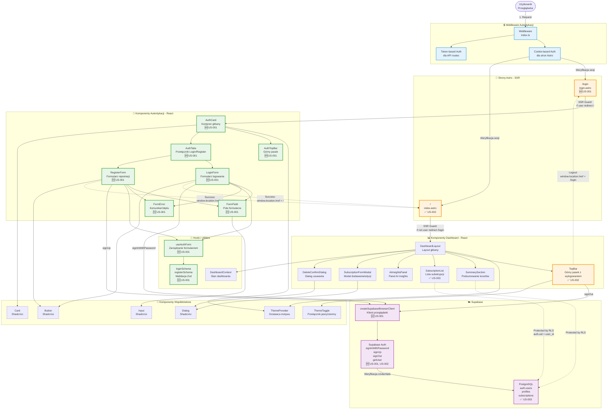

# Diagram Architektury UI - Moduł Autentykacji Subbase

Data utworzenia: 2026-01-29

## Opis

Diagram przedstawia architekturę komponentów UI aplikacji Subbase z uwzględnieniem modułu autentykacji zgodnie z wymaganiami US-001, US-002, US-003 z PRD. Pokazuje relacje między stronami Astro (SSR), komponentami React, middleware autentykacji oraz Supabase Auth.

## Diagram

## Legenda

**Oznaczenia komponentów:**
- 🆕 **Zielone obramowanie** - Nowe komponenty dodane w ramach US-001, US-002, US-003
- ✅ **Pomarańczowe obramowanie** - Zaktualizowane istniejące komponenty
- 🔒 **Niebieskie obramowanie** - Middleware autentykacji
- ☁️ **Fioletowe obramowanie** - Warstwa Supabase

**Typy relacji:**
- **Pełna linia ze strzałką** `-->` - Bezpośrednia zależność komponentów
- **Przerywana linia ze strzałką** `-.->` - Przekierowania i flow autentykacji

**Kluczowe flow:**

1. **Flow Logowania:**
   - User → Middleware (cookie check) → `/login`
   - SSR Guard: jeśli zalogowany → przekierowanie na `/`
   - Renderowanie `AuthCard` → `LoginForm`
   - Submit → `signInWithPassword()` → Supabase Auth
   - Sukces → `window.location.href = "/"` (full reload)

2. **Flow Rejestracji:**
   - User → `/login` → zakładka "Rejestracja"
   - Renderowanie `RegisterForm`
   - Submit → `signUp()` → Supabase Auth
   - Trigger `handle_new_user()` → automatyczne tworzenie `profiles`
   - Sukces → automatyczne logowanie → przekierowanie na `/`

3. **Flow Dashboard:**
   - User → Middleware (cookie check) → `/`
   - SSR Guard: jeśli niezalogowany → przekierowanie na `/login`
   - Renderowanie `DashboardLayout` → komponenty dashboard
   - `TopBar` zawiera przycisk "Wyloguj"
   - Wylogowanie → `signOut()` → przekierowanie na `/login`

4. **Flow Izolacji Danych (RLS):**
   - `SubscriptionList` → API `/api/subscriptions`
   - Middleware weryfikuje JWT token z `Authorization` header
   - Supabase RLS filtruje dane: `auth.uid() = user_id`
   - Użytkownik widzi tylko swoje subskrypcje

## Kluczowe Decyzje Architektoniczne

### 1. Hybrydowe Renderowanie
- **Strony Astro** - SSR (`output: "server"`) dla optymalnej wydajności i SEO
- **Komponenty React** - Hydratacja `client:load` dla interaktywności
- **Przekierowania** - Realizowane po stronie serwera (brak migotania)

### 2. Podwójny Mechanizm Autentykacji
- **Cookie-based** - dla stron Astro (SSR) z automatycznym refresh tokenów
- **Token-based** - dla API routes (stateless) z JWT w `Authorization` header

### 3. State Preservation
- `AuthCard` zachowuje wartości formularzy przy przełączaniu zakładek
- `loginFormValues` i `registerFormValues` w lokalnym state
- Callback `onValuesChange` dla synchronizacji

### 4. Fail-safe Navigation
- `window.location.href` zamiast client-side routing dla wymuszenia full reload
- Zapewnia weryfikację sesji przez middleware po każdym przekierowaniu
- Czyści stan aplikacji (React context) po wylogowaniu

### 5. Row-Level Security
- Supabase RLS na poziomie bazy danych
- Server-side enforcement `user_id` (zawsze z `locals.user.id`)
- Polityki: `auth.uid() = user_id` dla wszystkich operacji CRUD

## Zgodność z Wymaganiami PRD

### US-001: User Registration and Login
- ✅ Strona `/login` z zakładkami Login/Register
- ✅ Walidacja klient-side (Zod) z komunikatami w PL
- ✅ Integracja Supabase Auth (`signInWithPassword`, `signUp`)
- ✅ Automatyczne logowanie po rejestracji
- ✅ State preservation przy przełączaniu zakładek

### US-002: Automatic Redirects and Logout
- ✅ SSR Guards na stronach (`if user` / `if !user`)
- ✅ Middleware weryfikuje sesję (cookies dla stron, JWT dla API)
- ✅ Przycisk "Wyloguj" w `TopBar`
- ✅ `signOut()` → usunięcie cookies → przekierowanie

### US-003: User Data Isolation
- ✅ Row-Level Security (RLS) na `profiles` i `subscriptions`
- ✅ Server-side enforcement `user_id`
- ✅ Automatyczne tworzenie `profiles` przez trigger
- ✅ Filtrowanie danych w `SubscriptionList` przez RLS

## Komponenty Kluczowe dla Autentykacji

**Frontend:**
- `AuthCard` - główny kontener z zarządzaniem stanem
- `LoginForm` / `RegisterForm` - formularze z walidacją
- `useAuthForm` - generyczny hook do zarządzania formularzami
- `TopBar` - wylogowanie

**Backend:**
- `src/middleware/index.ts` - weryfikacja sesji
- `createSupabaseBrowserClient()` - klient dla przeglądarki
- Supabase Auth - zewnętrzny serwis autentykacji

**Baza Danych:**
- `auth.users` - użytkownicy (zarządzane przez Supabase)
- `public.profiles` - profile użytkowników (automatyczne tworzenie)
- RLS policies - izolacja danych

---

**Koniec diagramu UI**
